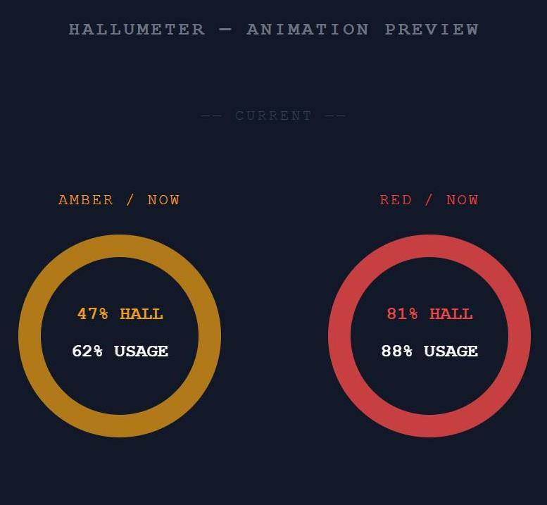

# HalluMeter

By [Efstathios Outas (EFS.O)](https://github.com/Efs-O)

[](https://github.com/sponsors/Efs-O)
[](https://buymeacoffee.com/efs.o)

**Know when your AI is about to lose the plot.**

HalluMeter is a lightweight always-on-top desktop overlay that monitors your AI coding session's context window in real time and warns you before hallucinations creep in.

Research shows every frontier model degrades as context fills — accuracy drops from ~95% to 60–70% as the window loads up. HalluMeter makes that invisible risk visible.



---

## How it works

HalluMeter reads your local session files, calculates how full your context window is, and maps that to a hallucination risk score using research-backed degradation curves. A colour-coded ring sits on your desktop at all times:

| Ring colour | Meaning |
|---|---|
| 🟢 Green | Low risk — model is reliable |
| 🟡 Amber | Degradation beginning — consider wrapping up or starting a new session |
| 🔴 Red | High risk — output quality is significantly reduced |

Audio cues play periodically as a background reminder, so you don't have to watch the ring.

---

## Supported tools

| Tool | Status |
|---|---|
| Claude Code (CLI) | Supported |
| Claude Code (VS Code / Cursor extension) | Supported |
| OpenAI Codex (CLI) | Supported |
| Continue (VS Code / JetBrains) | Supported — local LLMs via `~/.continue/config.yaml` or [LlamaBridge](https://github.com/Efs-O/LlamaBridge) `bridge.yaml` |
| [Forge](https://github.com/Efs-O/Forge) (VS Code, local llama.cpp) | Supported |
| Cursor Agents | Supported |

> **Continue / local LLM note:** HalluMeter reads the context window size from `contextLength` in `~/.continue/config.yaml`. If `contextLength` is not set for the active model, that session will not appear — set it for every model you want monitored. If you use [LlamaBridge](https://github.com/Efs-O/LlamaBridge), HalluMeter can read context sizes directly from your `bridge.yaml` (`num_ctx` per model) — set the `continue_bridge_yaml` path in [SETTINGS.md](SETTINGS.md). Token fill is a best-effort estimate correlated from Continue's local telemetry files. Hallucination risk scores for local open-source models (Llama, Qwen, Gemma, Mistral, etc.) use a **generic fallback curve** — see [RESEARCH.md](RESEARCH.md) for why accuracy is lower than for Claude Code or Codex.

---

## Install

Download the latest release for your platform from the [Releases page](https://github.com/Efs-O/hallumeter/releases).

> No installer needed on Windows — just run the `.exe`.

---

## Build from source

**Requirements:** Rust (stable), Node 24+, platform deps (see below)

```bash
# Install frontend deps
npm install

# Run in dev mode
npm run tauri dev

# Build release binary
npm run tauri build
```

**Linux only** — install system deps first:
```bash
sudo apt-get install -y libasound2-dev libwebkit2gtk-4.1-dev libappindicator3-dev librsvg2-dev patchelf
```

**macOS** — Xcode Command Line Tools required:
```bash
xcode-select --install
```

**Run tests:**
```bash
cargo test --manifest-path src-tauri/Cargo.toml
npx vitest run
```

---

## Settings

HalluMeter's thresholds, activity window, and session limits can be customised by editing a JSON file in a text editor — no reinstall needed. See [SETTINGS.md](SETTINGS.md) for the full reference.

---

## Why does context window fill cause hallucinations?

The short answer: models lose track of information buried in the middle of long contexts, and their internal attention mechanisms degrade under load.

The Chroma "Context Rot" study (2025) tested 18 frontier models and found every single one degrades as context increases — no exceptions. Accuracy drops from 95% to 60–70% as context fills, even on trivially simple tasks. The Stanford/Berkeley "Lost in the Middle" paper found a 15–20 percentage point accuracy gap between information at the edges vs the middle of a long context.

HalluMeter's degradation curves are calibrated to this research. See [RESEARCH.md](RESEARCH.md) for full sources and methodology.

---

## Acknowledgements

Built with [Tauri](https://tauri.app), [Svelte](https://svelte.dev), and Rust.
Audio playback via [rodio](https://github.com/RustAudio/rodio).
Developed with the assistance of [Claude Code](https://claude.ai/code).

---

## If you find HalluMeter useful

Give it a ⭐ on GitHub — it helps others discover the project and keeps development going.

---

## License

Apache 2.0 — see [LICENSE](LICENSE).
